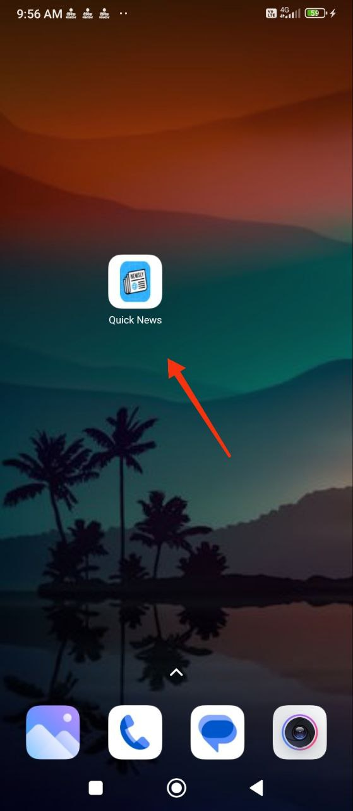
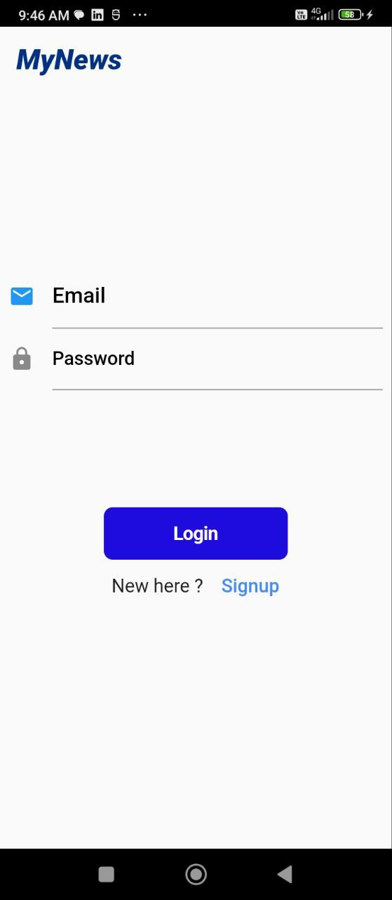

# News App
# News App Using Flutter FrameWork with Firebase authentication and fetch News from  https://newsapi.org/ 

 |  

<table>
 <td>
  

    
  

  
AppIcon

  
</td>
 <tr>
 

  
<!--   <td></td> -->
  <td></td>
  <td></td>
  <td></td>
 
</tr> 
 </table>
<table>
 <tr>
    <td></td>
  <td></td>
  
</tr>
 </table>
 
<!-- #

#

#

#

#

#

# -->
## Technologies Used
* Android Studio
* VS Code
* Flutter
* Dart
* Firebase
* API
* Android Emulator

Thank you! ☺️

made with ❤️ by Sanjiv Kushwaha.
#
## Just follow☝️ me and Star⭐ my repository 

